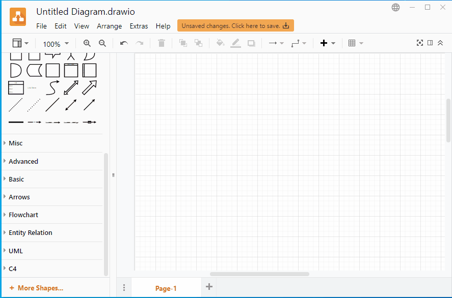

# Resize C4 model diagrams in diagrams.net

[Diagrams.net (previously drawio)](https://www.diagrams.net/) has shapes for the [C4 model of visualising software architecture](https://c4model.com/).

When I initially added a diagram, I couldn't resize it. But came across a solution via [Google Groups}(https://groups.google.com/g/drawio/c/4D7WfLUajYY)

- Select the shape
- Click `Ctrl+e` (aka "Edit Style")
- Look for `resizable=0`. Change `resizable=0` to `resizable=1`;
- Go to tab "Arrange". Tick "Constrain proportions"

Gif version

