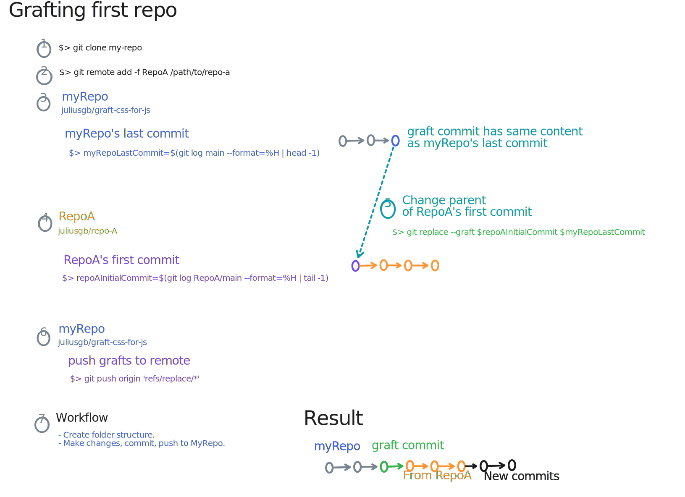
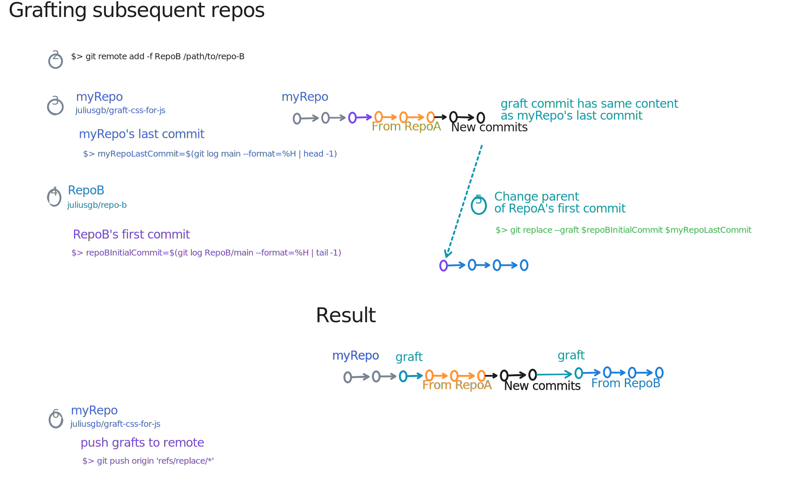

# Git grafts - merge history of multiple repos

## Intention

I'm currently learning CSS through [Josh Comeau](https://twitter.com/JoshWComeau)'s excellent course, [CSS for JS](https://css-for-js.dev/). Each module has workshops/exercises that we work through. Each of these is a git repository on GitHub. My workflow has been to fork it and make changes on the fork. But looking at my GitHub repository page shows these as standalone repositories, which feels cluttered to me.

So I wanted to have a workflow that enables me to:

1. have one repo for the course;
2. keep the history of commits from the upstream repos in my one repo;
3. in that repo, have subdirectories that match each workshop;
4. make my commits on my repo.

To do that, especially around point 2, I ended up using [`git grafts`](https://git-scm.com/docs/git-replace#Documentation/git-replace.txt) and [`git-filter-repo`](https://github.com/newren/git-filter-repo). Continuing down this path has a few caveats:

- The steps are more involved than I expected.
- In additional to `git`, I needed another tool (`git-filter-repo`) to deal with some unexpected behaviour, where Git grafting doesn't retain the files. I thought using git's native `pull` would do the trick. But, even after that, files were missing. `git-filter-repo` also requires `python3`, which if I didn't have, I'd have to install.
- Because I'm not going to look in the history that much, I don't mind that `git-filter-repo` rewrites all the commits. I want the history to just be there ¯\_(ツ)_/¯

### What I ended up doing

Upon reflection, point 2 doesn't matter to me as much as I thought. I don't need the git history of the upstream repos.

That means, in my repo [`course-css-for-js`](https://github.com/juliusgb/course-css-for-js),

- I'll keep the folder structure that I prefer: `module1/workshop/exercise` for the exercise and `module1/workshop/solution` will have my attempted solution and that from the course.
- I'll avoid branches to keep it simple. That way, even if I don't know git or forget it, I still have all folders present when I need them.

## `git replace --graft` - what worked

Git Grafts is what git offers us to change the parent of a commit.

### Grafting first repo

Visually, the process looks like this:

[](Graft-First-Repo.svg)

```sh
# clone the repo
git clone git@github.com:juliusgb/graft-css-for-js.git

# add remote and fetch it immediately afterwards (-f)
git remote add -f RepoA git@github.com:css-for-js/huckleberry.git

# MyRepo's last commit
myRepoLastCommit=$(git log main --format=%H | head -1)

# RepoA's last commit
repoAFirstCommit=$(git log RepoA/main --format=%H | tail -1)

# make MyRepo's last commit be parent of RepoA
git replace --graft $repoAFirstCommit $myRepoLastCommit
```

Check that replacement worked with `git show-ref | grep replace`

Output looks like

```console
cb3fb7397509012fbf4d2a5f84adbdc9602a098f refs/replace/0723669f06608f6027c0afe2864432dd7758914f
```

Then fetch changes from RepoA and merge them into main `branch`

```sh
# fetch and merge changes
git pull RepoA main

# verify with git log. 
# Also check folder that all files are present.
```

Move these into their own subdirectory, commit, and push to remote.

Ensure that you also push the grafts (found in <https://stackoverflow.com/a/42457384>)

```sh
git push origin 'refs/replace/*'
```

### Cloning repo and fetching git grafts from remote

When cloning the repo, do:

```sh
# normal clone
git clone git@github.com:juliusgb/css-for-js.git
# fetch all the grafts
git fetch origin 'refs/replace/*:refs/replace/*'
# check that grafts have been fetched
git show-ref | grep replace
```

To make the local repo always fetch grafts (in case someone else has pushed a new graft to the remote repo), add the following to `.git/config`

```console
[remote "origin"]
    url = ...
    fetch = +refs/heads/*:refs/remotes/origin/*
    fetch = +refs/replace/*:refs/replace/*
```

### Grafting second and subsequent repos

Visually, the process looks like this

[](Graft-Subsequent-Repos.svg)

To graft more repos, I needed `git-filter-repo`. Read <https://github.com/newren/git-filter-repo#how-do-i-install-it> to install it, meaning:

- download latest release from <https://github.com/newren/git-filter-repo/releases> and extract it somewhere
- in Git-Bash, add it to the path `PATH=$PATH:/c/opt-manual/git-filter-repo-2.38.0/`
- in shell, navigate to your repo. Then run `git filter-repo --analyze`  to verify that installation and setup worked.

Graft additional repo, say `repo-B`:

```sh
# add remote and fetch it immediately afterwards (-f)
git remote add -f RepoB git@github.com:css-for-js/repo-b.git

# MyRepo's last commit
myRepoLastCommit=$(git log main --format=%H | head -1)

# RepoA's last commit
repoAFirstCommit=$(git log RepoB/main --format=%H | tail -1)

# make MyRepo's last commit be parent of RepoB
git replace --graft $repoAFirstCommit $myRepoLastCommit
```

Check that replacement worked with `git show-ref | grep replace`

Output looks like

```console
cb3fb7397509012fbf4d2a5f84adbdc9602a098f refs/replace/0723669f06608f6027c0afe2864432dd7758914f
abc3fb7397509012fbf4d2a5f84adbdc9602a09f refs/replace/123abcf06608f6027c0afe2864432dd7758914f
```

Then run the following to [modifying commit not to delete files](https://github.com/newren/git-filter-repo/issues/170#issuecomment-964692952)

```sh
git filter-repo --commit-callback 'if commit.original_id == b"123abcf06608f6027c0afe2864432dd7758914f": commit.file_changes = [x for x in commit.file_changes if x.type != b"D"]'
```

Push all grafts to remote

```sh
git push origin 'refs/replace/*'
```

### Git commit

Running `gitk` shows the commits that have been grafted

[](/assets/2023-01-04-git-replace-graft/Git-Commits-With-Without-Grafting.PNG)
