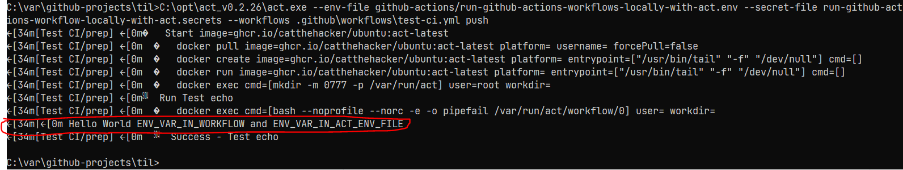

# How do I quickly test github workflows on my local dev machine even for self-hosted runners?

Write-up also at <https://juliusgamanyi.com/2022/04/27/run-github-actions-workflows-locally-using-act>

I'm spending more time recently working with GitHub actions and runners.  
I've found it helpful to test the GitHub Actions workflows on my local dev machine
to get quick feedback and to also not populate my git histoy with "fix" commits.

Prerequisite: I have docker running on my machine

Steps:

1. Download and configure `act` and test initial run
2. Configure `act` to use non-default docker image with env vars and secrets
3. Configure `act` for self-hosted runners
4. Run `act` with debug to see what `act` is doing

## Download and Configure `act`

Download act from the <https://github.com/nektos/act/releases> or clone the repo.

Run `act --dryrun` so that `act` creates its default config file in `$HOME/.actrc`.
Since I'm using windows, I'll use the file path separator.

`act --dryrun --workflows .github\workflows\test-ci.yml --verbose --list`

Looking at `$HOME/.actrc`, these default entries should exist:

```text
-P ubuntu-latest=ghcr.io/catthehacker/ubuntu:act-latest
-P ubuntu-20.04=ghcr.io/catthehacker/ubuntu:act-20.04
-P ubuntu-18.04=ghcr.io/catthehacker/ubuntu:act-18.04
```

## Configure act to use non-default docker image with env vars and secrets

The images that `act` used are listed in a table - <https://github.com/nektos/act#runners>.
What does that table mean?

In a workflow file, say [my markdown-lint.yml](../.github/workflows/markdown-lint.yml),
the job definition looks like this:

```yml
. . .
jobs:
  lint:
    runs-on: ubuntu-latest
```

That `runs-on` tag tells the runner to use the `ubuntu-latest` image when executing the job.

When running the job locally, `act` has to somehow know which docker image to use when it sees the `ubuntu-latest` in the workflow yml file.

- This mapping exists in the `act` config file, `$HOME/.actrc`.
- The `ubuntu-latest` tag points to the docker image `ghcr.io/catthehacker/ubuntu:act-latest`

In a simplified way, `act` does the following:

- reads the workflow yml
- finds that the job should run on `ubuntu-latest`
- looks up its config, sees `ubuntu-latest` is mapped to `ghcr.io/catthehacker/ubuntu:act-latest`
- somehow prepares `ghcr.io/catthehacker/ubuntu:act-latest`
- runs the workflow yml job on `ghcr.io/catthehacker/ubuntu:act-latest`.
  
If I'd like to use another docker image, then I update the `act` config file, `$HOME/.actrc`,
and add the following entry:

```text
-P ubuntu-latest=localhost:5000/my-awesome-docker-image:0.1.0
```

Now `act` will run the workflow on docker image `localhost:5000/my-awesome-docker-image:0.1.0`

## Setup for self-hosted runners

If I'm using self-hosted runners, then the job definition in the workflow yml would look like this:

```yml
. . .
jobs:
  prep:
    runs-on: [self-hosted, my-awesome-runner]
```

Then I update the `act` config file, `$HOME/.actrc` and add the following entries:

```text
-P self-hosted=localhost:5000/myawesomeselfhostedrunner:0.2.0
-P my-awesome-runner=localhost:5000/myawesomeselfhostedrunner:0.2.0
```

Now when `act` runs, it will this docker image.

If I want to run a custom `runs-on` tag against the `act` default images,
replacing the above, i.e., `localhost:5000/myawesomeselfhostedrunner:0.2.0` with `ghcr.io/catthehacker/ubuntu:act-latest` would also work:

```text
-P self-hosted=ghcr.io/catthehacker/ubuntu:act-latest
-P my-awesome-runner=ghcr.io/catthehacker/ubuntu:act-latest
```

## Run `act` with debug to see what `act` is doing

Use the `--verbose` option to see more details on what `act` is doing when listing the jobs available in the workflow yml file.
I've added a `.secrets` in case some GitHub Actions require a token to do something.
To avoid accidentally committing these, add them to `.gitignore`
The CLI options are also documented at <https://github.com/nektos/act#configuration>

`act --env-file github-actions\run-github-actions-workflows-locally-with-act.env --secret-file run-github-actions-workflow-locally-with-act.secrets --workflows .github\workflows\test-ci.yml --verbose --list`

The output would look like this:

| Stage | Job ID | Job name | Workflow name | Workflow file | Events |
|-------|--------|----------|---------------|---------------|--------|
| 0     | prep   | prep     | Test CI       | test-ci.yml   |  push  |

Run a specific job (remove `--dryrun` and add `--job`):

`act --env-file github-actions/run-github-actions-workflows-locally-with-act.env --secret-file run-github-actions-workflow-locally-with-act.secrets --workflows .github\workflows\test-ci.yml --verbose --job prep`

Run when a specific event (such as `push`) occurs on the repository:

`act --env-file github-actions/run-github-actions-workflows-locally-with-act.env --secret-file run-github-actions-workflow-locally-with-act.secrets --workflows .github\workflows\test-ci.yml --verbose push`

Output looks like:


