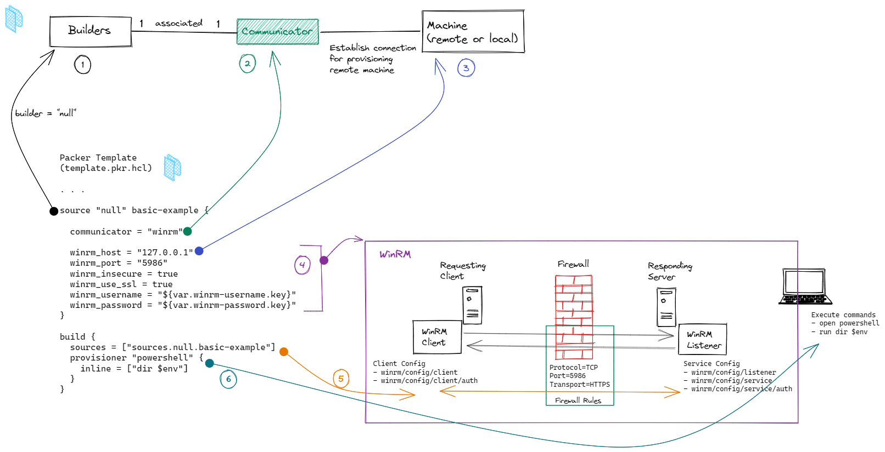

# Packer - setup with WinRM

Aim: Use HashiCorp's [Packer](https://www.packer.io) and WinRM to automatically create a directory as an example.
When that works, we're ready for [[Packer - setup local dev environment on Windows using Packer]]

Prerequisites:

- `Winrm` has been setup. `Winrm` is to Windows what `ssh` is to Linux.
Just as Packer uses `ssh` to remotely manage Linux machines, so does [Packer use `winrm` to remotely manage Windows machines](https://www.packer.io/docs/communicators/winrm).
To set up `winrm`, follow the TIL, <https://github.com/juliusgb/til/blob/main/winrm/setup-winrm.md>
- You've downloaded Packer. See <https://www.packer.io/downloads>

At the end of this TIL, we'll use these steps:

1. [Setup winrm](https://github.com/juliusgb/utils/blob/main/powershell/SetupWinRM.ps1)
2. Validate and run the packer template file that echos something on the console and copies a file to another directory.
3. [Cleanup winrm](https://github.com/juliusgb/utils/blob/main/powershell/CleanupWinRMSetup.ps1)

## Relevant Packer concepts

For connecting to the remote machine, we need to understand the two concepts of "_communicator_",
how it relates to the "_builders_", to "_winrm_", and to the remote machine (in this case, my laptop).

I'm running Packer on my laptop and telling it to install tools on the same machine.
Because of this, I don't need builders[^1]
that will create other types of machines.
So, I'm using the ["_null_" builder](https://www.packer.io/docs/builders/null), which doesn't generate any machine images.

[^1]: "Builders are responsible for creating machines and generating images from them for various platforms. For example, there are separate builders for EC2, VMware, VirtualBox, etc. Packer comes with many builders."---[Packer builder docs](https://www.packer.io/docs/templates/legacy_json_templates/builders)

When it comes to relation between builders and communicators[^2],
there's a one-to-one association.

[^2]: "Communicators are used to establish a connection for provisioning a remote machine (such as an AWS instance or local virtual machine)."---[Packer communicator docs](https://www.packer.io/docs/communicators)

Visually, the relation looks like this:

[](BuilderCommunicatorsRemoteMachine.png)

When we add the [winrm communicator](https://www.packer.io/docs/communicators/winrm) that we configured in the TIL, [[WinRM - setup and test on Windows laptop]], it would look like this:

[](CombinePackerTemplateWithWinrm.png)

How the Packer template file relates to the other components is as follows:

1. In the packer template, declare what "_builder_" to use. In this case, `null`
2. Declare what "_communicator_" to use. In this case `winrm`.
3. Declare where to find the remote machine. In this case, the localhost IP address
4. Declare details required connect via WinRM to the localhost.
Details of the "WinRM" box are covered in another TIL, [[WinRM - setup and test on Windows laptop]]
5. Packer establishes a network connection to the remote machine via `winrm`.
6. Packer sends instructions that are executed on the remote machine. In our case, it's still the same localhost.

## Packer template file

The template file, named `template.pkr.hcl`, is as follows (ignore the red markings):

```hcl
variable "winrm-username" {
  sensitive = true
  default = {
    key = "juliusg"
  }
}

variable "winrm-password" {
  sensitive = true
  default = {
    key = "SECR3TP4SSW0RD"
  }
}

variable "image_folder" {
  type = string
  default = "C:\\tmp\\vm-image\\"
}

source "null" basic-example {
  communicator = "winrm"
  winrm_host = "127.0.0.1"
  winrm_port = "5986"
  winrm_insecure = true
  winrm_use_ssl = true
  winrm_username = "${var.winrm-username.key}"
  winrm_password = "${var.winrm-password.key}"
}

build {
  sources = ["sources.null.basic-example"]
  
  provisioner "powershell" {
    inline = ["dir $env"]
  }
  provisioner "powershell" {
    inline = ["New-Item -Path ${var.image_folder} -ItemType Directory -Force"]
  }
  provisioner "file" {
    destination = "${var.image_folder}"
    source = "hello.txt"
  }
}
```

## Run Packer

I use this workflow to run the Packer template:

1. [Setup winrm](https://github.com/juliusgb/utils/blob/main/powershell/SetupWinRM.ps1)
2. Save that Packer template file somewhere, say `C:\tmp\packer-test`
3. Open PowerShell console and navigate to that directory. And add file `hello.txt`
4. Syntanctially validate the Packer file
with `C:\opt\Packer\packer_1.8.2\packer.exe validate -syntax-only template.pkr.hcl`
5. Semantically validate the packer template
with `C:\opt\Packer\packer_1.8.2\packer.exe validate template.pkr.hcl`
6. Build Packer template
with `C:\opt\Packer\packer_1.8.2\packer.exe build template.pkr.hcl`
7. Packer should take about 15 to 25 seconds to finish.
8. Verify that `hello.txt` was copied to `C:\tmp\vm-image\`
9. [Cleanup winrm](https://github.com/juliusgb/utils/blob/main/powershell/CleanupWinRMSetup.ps1)
