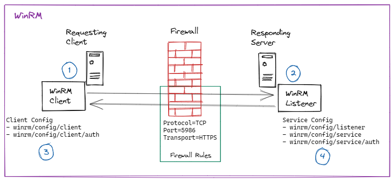

# WinRM - setup and test on Windows laptop

WinRM is to Windows what SSH is to Linux.

Aim: setup and test `winrm`on Windows 10 dev laptop.

Why? I'd like to automate setting up my development tools with Packer. See TIL, [[Packer - setup local dev environment on Windows using Packer]].

- Packer uses `winrm` to [communicate with with remote windows-based machines](https://www.packer.io/docs/communicators/winrm).
- `winrm` is [Microsoft's recommended way](https://docs.microsoft.com/en-us/powershell/scripting/learn/remoting/winrmsecurity?view=powershell-7.2) to remotely connect to, and manage, Windows machines.

By the end of this TIL, we'll have

- a [PowerShell script](https://github.com/juliusgb/utils/blob/main/powershell/SetupWinRM.ps1) that sets up and configures `winrm`
- manually connecting to local machine using `winrm`
- another [PowerShell script](https://github.com/juliusgb/utils/blob/main/powershell/CleanupWinRMSetup.ps1) that cleans up what we had setup

Prerequisites:

1. able to run the PowerShell console as Administrator.
2. Ensure the `winrm` has started:

    - Start PowerShell console as Admin
    - check if `winrm` service is running with `winrm e winrm/config/listener` or `PS> Get-ChildItem WSMan:\localhost\Listener`
    - if you get errors, start and configure firewall for `winrm` service with `winrm quickconfig` and answer `y` when prompted.

## Relevant WinRM components

WinRM is to Windows what ssh is to Linux.
I've simplified its [official Client-Server architecture diagram](https://docs.microsoft.com/en-us/windows/win32/winrm/windows-remote-management-architecture)
leaving what's relevant for the setup on one machine, such as my laptop.

[](WinRM-Client-with-Server.png)

1. The client talks to the server and the server responds. "_server_" refers to the "_service_"
2. The server has the `listener`, i.e., where the `listener` is, there's the server.
3. When running powershell console as Administrator, we can see the client configuration using `winrm get winrm/config/client`
4. When running powershell console as Administrator, we can see the service configuration using `winrm get winrm/config/service` and that of the _listener_ using `winrm get winrm/config/listener`

## Setup WinRM

Even though I started this to get Packer to work, [Packer's guide](https://www.packer.io/docs/communicators/winrm) left much to be desired:

- I'm not creating an additional user just for integrating with Packer.
- Using the self-generated certificate with `packer` as DnsName didn't work.
This becomes important when manually connecting to localhost via WinRM.
- `netsh advfirewall` looks deprecated.

The best guide I've found so far is <http://woshub.com/powershell-remoting-over-https>. Complement it with the [Microsoft docs](https://docs.microsoft.com/en-us/windows/win32/winrm/installation-and-configuration-for-windows-remote-management).

That I've used. The script, <https://github.com/juliusgb/utils/blob/main/powershell/SetupWinRM.ps1>, does the following:

- Enable PowerShell remoting.
- Generate a self-signed SSL certificate using the computer's name (`$env:COMPUTERNAME`) as hostname and save it the local (client) truststore.
- Create WinRM SSL listener and bind the self-signed SSL certificate to it.
- Create a Windows Firewall rule that allows WinRM HTTPS traffic.
- Make WinRM client connections accept unencrypted traffic. Since it's my laptop, I can take the risk.
- Export the self-signed SSL certificate as a `.cer` file
- Import the self-signed SSL certificate into the root (server) truststore.

## Manually check certificates

1. check that the self-signed SSL certificate was saved in local (client) truststore.

    - on start, search Certificate -> click on pop up.
    - top level certificate icon should show "Certificate - Local Computer"
    - click Own Certificates -> Certificates -> One should be in there
    - Select it and check that the `Issued by` matches the computer name.
2. check that self-signed SSL certificate was imported in root truststore.
    - on start, type regedit -> click on pop up.
    - navigate to HKEY_LOCAL_MACHINE\Software\Microsoft\SystemCertificates\ROOT\Certificates
    - look for the directory that matches the certificate thumnprint.
    - To find the Certificates' thumbprint, run in PowerShell 
    `Get-ChildItem -Path 'Cert:\LocalMachineKey\My' | Where-Object Issuer -eq "CN=$env:COMPUTERNAME"`

## Manually connect to localhost using WinRM

Open another PowerShell console and run the following:
Remember to substitute `juliusg` with your details

```console
PS> $SessionOption = New-PSSessionOption -SkipCNCheck
PS> Enter-PSSession -Computername $env:COMPUTERNAME -UseSSL -Credential juliusg -SessionOption $SessionOption
```

A pop-up appears, asking for your credentials.
Afterwards, the PowerShell console looks like this:

```console
[LAPTOP-Name]: PS: C:\Users\juliusg\Documents> 
```

Type `exit` to quit the WinRM connection to the local machine.

## Cleanup

The cleanup script, <https://github.com/juliusgb/utils/blob/main/powershell/CleanupWinRMSetup.ps1>, does the following:

- Removes the self-signed SSL certificate from local truststore.
- Removes WinRM HTTPS firewall rule.
- Restores default settings: WinRM client configurations don't allow unencrypted connections.
- Removes the self-signed SSL certificate from root (server's) truststore.
- Deletes imported certificate `.cer` file from the `C:\tmp\winrm-prep` directory.

## References

- Basis: http://woshub.com/powershell-remoting-over-https/